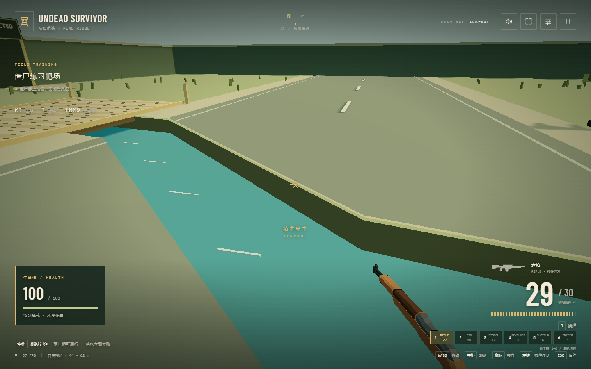

# Undead Survivor

基于 [Undead Tower](https://github.com/xcymm3/Undead-Tower) 开发的低多边形第一人称生存射击游戏。在灰松哨站封锁区内自由移动、跳河与射击，利用桥梁抵挡一波波追踪玩家的僵尸。

## 下载 Windows 版

[下载最新 Windows x64 便携版](https://github.com/xcymm3/Undead-Survivor/releases/latest)。无需安装，下载 Release 中的 `Undead-Survivor-版本号.exe` 后双击运行；首次运行可能出现 Windows SmartScreen 提示。



## 怎么玩

- **练习模式**：僵尸是不会移动的靶子，击倒后会重新出现。可以熟悉瞄准、切枪、换弹和跳河；靶子不攻击，落水扣 10 血并回出生点，不记录成绩。
- **正式模式**：首波 **9 只**；第 1～6、7～8、9～11、12 波以后每波分别增加 **6、5、4、3 只**。基础移速从 **1.4 米/秒**每波增加 **0.18 米/秒**，达到 **2.8 米/秒**后封顶。刷新率每波增加 **0.18 只/秒**，最高 **2.8 只/秒**。整波刷完并全部击杀后全员恢复至 **100 HP**，休整 **3 秒**再进入下一波。
- **四阶尸群**：每两波升级。第 1～2 波仅有一阶；第 3～4 波一／二阶权重为 80%／20%；第 5～6 波一／二／三阶为 64%／26%／10%；第 7～8 波四阶加入，四阶位权重为 50%／28%／17%／5%，每波至少 1 只橄榄球僵尸；第 9～10 波为 38%／30%／24%／8%；第 11 波起为 32%／30%／28%／10%。
- **近身攻击**：僵尸绕过障碍追踪玩家，移动时会明显抬脚、摆臂并随步伐起伏，近身停下挥臂攻击。初始生命 **100**，每次攻击造成 **10** 点伤害；受伤后有 **0.3 秒**保护，前摇 **0.35 秒**，普通攻击周期 **1.1 秒**。退开、及时跳起或击杀可以躲过攻击，血量归零后播放失败特写并结算。
- **有限场地**：44 × 62 米，四周围墙限制移动。建筑、巡逻车、路障和活僵尸阻挡穿身，沿障碍移动可以滑行绕开。
- **河流与桥**：场地中间有一条约 **2.5 米宽**的弯曲河道，连接两岸的桥共 **2 座**。僵尸不能跳跃，只能从桥上过河。玩家按空格后会按当前视角的正前方跳跃，最远约 **3.9 米**；空中转动视角可以改变方向，WASD 要到落地后才重新生效。靠近岸边起跳可以过河，直接走入河流或在水中落地会立即判负。
- **固定入口**：北侧、东侧各 3 个刷怪点，西侧和南侧不刷新。每次只使用玩家当前前方半平面内、距离至少 8 米、可通行且无人占用的入口；无合适入口就等待，不减少本波配额，也不积攒突发补刷。已刷出的僵尸仍会继续追击。
- **辨认威胁**：小鬼体型小且攻击频繁；持盾者正面防御但攻击时会放低盾牌；狂暴者半血后永久狂暴；巨人拥有 6000 HP，缓慢推进并范围砸击；持盾者为 200 本体 HP 加 500 盾牌 HP；狂暴者半血后移速为基础速度的 2.6 倍、最高 5.8 米/秒；橄榄球平时移速为基础速度的 1.25 倍（破甲后 1.05 倍）、最高 3.3 米/秒；冲锋为基础速度的 4.2 倍、最高 10 米/秒，蓄力 0.35 秒、冷却 3.2 秒。橄榄球只有在直线路径连通时才蓄力，隔河先绕桥；开始蓄力时锁定方向，随后沿直线冲锋，不追随玩家转向；冲锋撞到实体障碍会眩晕，接近水边则取消并重新寻路。路障和铁桶的护具脱落后变成普通僵尸。

仅橄榄球保留单类在场上限：第7～8波1只，第9～10波单人／双人2只、3～4人3只，第11波起分别3只／4只。其余特殊僵尸不设单类在场数量上限，仍遵循波次配额与全场总容量。每波总数量不变，通过更快刷新、更早引入精英及提高重型敌人压力，把普通玩家的挑战目标放在第10波附近；这是待试玩调校的目标，不是已验证的生存上限。

正式模式没有固定通关时间，目标是清完更多波。排行榜按**已清完的波数**排序，同波数先比较击杀，再比较时长。例如第 2 波中途失败，成绩为 **1 波**。波次榜独立保存，不混入旧时长榜；保留当前浏览器的前 10 名，更换浏览器或清除网站数据后不会自动跟随。

## 操作

开局即可使用十款武器：**1 步枪、2 P90 冲锋枪、3 半自动手枪、4 左轮手枪、5 泵动霰弹枪、6 栓动狙击枪、7 消防斧、8 喷火枪、9 自动霰弹枪、0 重机枪**。前六款沿用 Quaternius 动画模型，后四款使用项目内构建的低多边形可动模型。

步枪、P90、喷火枪、自动霰弹枪和重机枪可以按住左键连续攻击，其余武器每次点击攻击一次。消防斧没有弹药限制，2.5 米内的扇形挥砍可同时攻击不同目标；喷火枪射程 12 米，火焰能穿过多个僵尸，但会被地形和建筑挡住。每把枪单独保留弹匣里的弹药，切枪不会补弹；备弹无限，但仍需要换弹。各武器拥有独立的攻击、装填或机械动作。

按住右键平滑举枪瞄准，松开退出。半自动手枪、左轮与泵动霰弹枪使用机械瞄具，保留枪身并隐藏普通十字准星；步枪使用 1.5× 红点镜，P90 使用 1.35× 全息镜，自动霰弹枪使用 1.25× 环形反射镜，重机枪使用 2× 刻度低倍镜。栓动狙击枪使用 6× 全屏圆形狙击镜，镜外遮黑，镜内显示十字刻度，保留生命值和弹量。消防斧与喷火枪使用普通稳定持握。

开镜会放大真实游戏视野，并按当前视野同步降低鼠标转向灵敏度；不会改变散布、伤害、射速或联机数据。准心与命中始终共用屏幕中心射线，保留枪口遮挡检测。换弹、切枪、暂停和失去鼠标锁定会退出瞄准。

| 等级 | 武器 | 容量 | 单次躯干伤害 | 攻击间隔 | 装填 | 定位 |
| --- | --- | ---: | ---: | ---: | ---: | --- |
| C | 半自动手枪 | 12 | 50 | 0.30 秒 | 1.20 秒 | 基础自卫 |
| B | 左轮手枪 | 6 | 150 | 0.45 秒 | 1.60 秒 | 高伤害单发 |
| B | P90 | 45 | 30 | 0.09 秒 | 1.50 秒 | 高频扫射 |
| B | 泵动霰弹枪 | 6 | 280（15颗合计） | 0.80 秒 | 每发 0.45 秒 | 横向扇面爆发 |
| B | 栓动狙击枪 | 5 | 280 | 0.85 秒 | 1.80 秒 | 3倍爆头，单发840伤害 |
| A | 步枪 | 30 | 60 | 0.12 秒 | 1.60 秒 | 精准持续射击 |
| A | 重机枪 | 100 | 45 | 0.09 秒 | 3.60 秒 | 长弹链压制，散布半角约0.8° |
| A | 消防斧 | ∞ | 300／目标 | 0.60 秒 | 无 | 2.5米近身挥砍 |
| A | 喷火枪 | 100 | 36 | 0.08 秒 | 2.40 秒 | 12米多目标穿透，无爆头加成 |
| A | 自动霰弹枪 | 12 | 192（17颗合计） | 0.36 秒 | 2.20 秒 | 宽扇面连续清群 |

普通枪械爆头2倍，狙击枪3倍，消防斧1.5倍，火焰1倍。重机枪散布按射击次数确定，单机与联机使用同一规则。普通枪械的含装填理论单体 DPS：C级约125，B级约209～243，A级约346～357；斧头免装填但必须近身，单目标约500。实际输出受命中率、弹丸覆盖、伤害溢出、攻击动画和操作间隔影响。

两把霰弹枪使用中心弹丸加上下两层横向扇面分布，每颗弹丸独立命中，适合瞄准并排僵尸的胸口扫群。在垂直于中心弹道、距枪口 5 米的平面上，单喷弹幕宽约 2.8 米、高约 0.75 米；连喷宽约 3.4 米、高约 0.95 米。右键瞄准不会收窄弹幕，越远单个目标能接到的弹丸越少。弹丸仍由枪口发出并受敌人、墙体及地形遮挡，不会自动锁定或无条件伤害扇面内所有敌人。分级平衡后保留15／17颗弹丸和原宽弹幕，每颗伤害分别为 280/15 与 192/17，保证单喷全中总伤害280、连喷192。

| 操作 | 功能 |
| --- | --- |
| WASD | 相对视角前后左右移动，速度 4.2 米/秒 |
| 空格 | 按起跳瞬间的 WASD 方向跳跃；未按方向键时原地跳，空中由鼠标转向，WASD 落地后恢复 |
| 移动鼠标 | 水平自由转向、垂直 ±85° 瞄准 |
| 鼠标左键 | 开火或挥砍 |
| 按住鼠标右键 | 使用当前武器的机械瞄具或专属瞄准镜，松开退出 |
| R | 换弹 |
| 数字键 1–0 / 鼠标滚轮 | 切换武器 |
| Esc | 释放鼠标并暂停 / 继续 |
| M | 静音 / 恢复声音 |
| 右上角设置 | 用滑块或数字调整鼠标灵敏度，并调整音量和画质 |
| 右上角全屏按钮 | 进入 / 退出全屏 |

开始后自动捕获鼠标，准星固定在屏幕中心。若浏览器拒绝捕获，点击场景重试；单人模式未捕获时战斗计时暂停。按 Esc 释放鼠标后可打开设置。单人模式切到其他窗口会自动暂停并清空移动按键，联机模式则继续对局。建议使用电脑、鼠标和键盘游玩。


## 在本地开始游戏

Windows 便携版可从 [GitHub Releases](https://github.com/xcymm3/Undead-Survivor/releases/latest) 下载，无需安装开发环境。单人可离线游玩，Steam 2～4 人合作请看 [EXE 联机说明](docs/MULTIPLAYER.md)；分发与数据保存见 [便携版说明](docs/PORTABLE.md)。以下步骤面向从源码运行的开发者。

1. 安装 [Node.js](https://nodejs.org/) **22.12 或更高版本**，安装时保留 npm。
2. 在本仓库页面点击 **Code → Download ZIP**，解压后进入包含 `package.json` 的文件夹。
3. 在这个文件夹中打开终端，依次运行：

```sh
npm ci
npm run dev
```

第一次安装依赖需要联网。终端显示启动成功后，在 Chrome 或 Edge 中打开 [http://127.0.0.1:5176/](http://127.0.0.1:5176/)，选择模式即可开始。

之后再玩，只需在同一文件夹运行 `npm run dev`。Windows 用户也可以双击 **start-game.cmd**，它会在需要时安装依赖并自动打开浏览器。

游玩期间保持终端窗口打开；结束后在终端按 `Ctrl+C` 即可停止。若终端显示了不同端口，请以终端中的本地地址为准。画面无法加载时，请确认浏览器已开启硬件加速。

## Steam 2～4 人协作（0.7.7 EXE 测试版）

首页「多人模式」可以创建、搜索或按房间号加入最多四人的房间。每名玩家开局随机生成 Quaternius 角色外形与服装配色，并同步给队友，复活时沿用。达到 2 人后房主即可开始，也可以继续等待至 4 人。玩家阵亡后以第一人称观战，点击鼠标左键切换存活队友；每波清完后全员恢复 100 HP，阵亡玩家在安全出生点复活。只有全队同时阵亡才结束，多人成绩不写入单人排行榜。

每名玩家需要一台 Windows 电脑和一个不同的 Steam 账号，所有人使用同一版本的 EXE，通过 Spacewar App ID 480 测试。从 Release 下载 `Undead-Survivor-0.7.7.exe` 和 `Multiplayer-Guide-0.7.7.txt` 发给朋友即可，无需安装开发环境。房间流程、画质调整和常见问题见 [EXE 联机说明](docs/MULTIPLAYER.md)。

## 开发验证

```sh
npm run test
npm run build
npm run test:e2e
```

浏览器测试使用单 worker 的 Chrome，独占端口 5177，不复用已有服务。开发服务使用 5176，避免与原项目冲突。2026-09-04 按用户要求打包当前 Windows 便携版。`docs/PROJECT.md`、`docs/BALANCE.md` 顶部记录当前规则，下方旧版评估仅供追溯。

## 鸣谢

前六款枪械模型来自 [Quaternius Animated Guns Pack](https://quaternius.com/packs/animatedguns.html)，多人角色来自 [Quaternius Ultimate Animated Character Pack](https://quaternius.com/packs/ultimatedanimatedcharacter.html)，均采用 CC0 许可。消防斧、喷火枪、自动霰弹枪和重机枪由项目代码使用基础几何体构建。

\n

### 菜单与联机外观

菜单采用 Hallmark Bloom 暖白与陶土色主题；声音、操控和画质集中在设置面板，按键及渲染诊断可展开查看。设计规则见 `design.md`。

每位玩家在每局开场随机生成一套角色与配色，复活时沿用；不再提供角色选择或读取旧皮肤存档。Steam 房间和战斗名单使用队员客户端读取的 Steam 昵称，通过已有 P2P 通道绑定到真实发送者同步；数字 SteamID 仍用于识别成员，房间号仍可复制用于加入。

界面取图：启动 `npm run dev -- --port 5178 --strictPort` 后运行 `node scripts/capture-bloom.mjs`。该脚本只截图，使用隐藏、静音浏览器；房间中的名字和人数为本地展示数据，不构成真实 Steam 联网验收。
